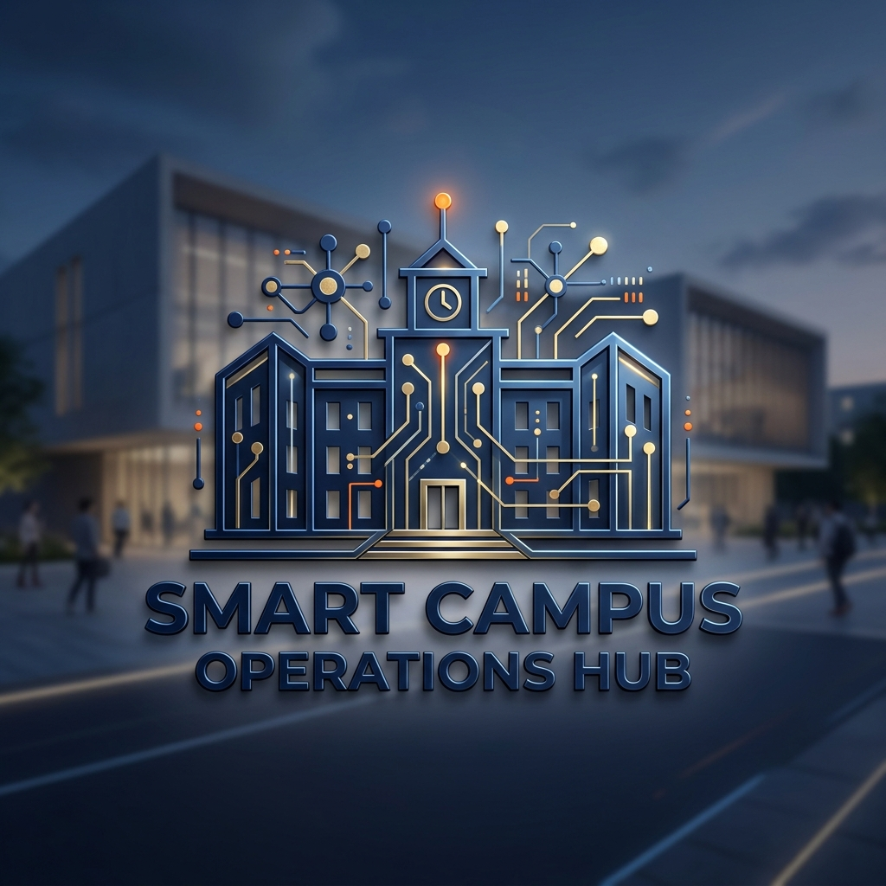
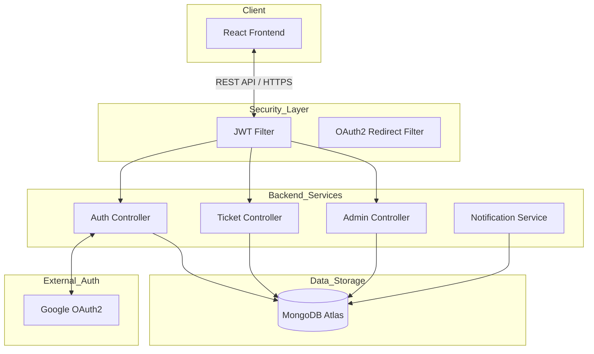

# 🏛️ Smart Campus Operations Hub



> **Centralized Operating System for Modern Educational Institutions.**

The **Smart Campus Operations Hub** is a robust, full-stack management platform designed to streamline campus operations. From real-time incident tracking to resource allocation and institutional analytics, the Hub provides a unified interface for students, technicians, and administrators.

---

## 🚀 Key Features

*   **🎫 Smart Ticketing System**: Real-time tracking and management of service requests with automated status updates.
*   **🔐 Secure Multi-Channel Auth**: Seamless Google OAuth2 integration restricted to institutional domains (`@my.sliit.lk`) alongside secure manual authentication.
*   **📊 Operational Analytics**: Dynamic dashboards providing real-time insights into campus resources and maintenance throughput.
*   **📅 Resource Management**: Centralized hub for tracking campus assets, bookings, and facility availability.
*   **🔔 Real-time Notifications**: Instant alerts for ticket updates, system announcements, and institutional news.

---

## 🛠️ Tech Stack

### Frontend
- **Framework**: React.js (Vite)
- **Styling**: Vanilla CSS (Modern, Premium Design System)
- **Icons**: Lucide React
- **State/Auth**: React Context API + JWT

### Backend
- **Framework**: Spring Boot 3 (Java 17)
- **Security**: Spring Security (JWT + OAuth2 Client)
- **API Documentation**: Swagger UI (OpenAPI 3.1)
- **Build Tool**: Maven

### Database & Cloud
- **Primary Database**: MongoDB Atlas (NoSQL)
- **Identity Provider**: Google Cloud Console (OAuth2)

---

## 🏗️ Architecture Overview

The system follows a modern **Decoupled Architecture**, ensuring scalability and high availability.



---

## ⚙️ Installation & Setup

### Prerequisites
- JDK 17+
- Node.js 18+
- MongoDB Atlas Account
- Google Cloud Project (for OAuth2)

### Backend Configuration
1. Navigate to `/backend`.
2. Create a `.env` file based on `.env.example`:
   ```properties
   MONGODB_URI=your_mongodb_connection_string
   GOOGLE_CLIENT_ID=your_client_id
   GOOGLE_CLIENT_SECRET=your_client_secret
   JWT_SECRET=your_secure_random_key
   ```
3. Run the application:
   ```bash
   mvn spring-boot:run
   ```

### Frontend Configuration
1. Navigate to `/frontend`.
2. Install dependencies:
   ```bash
   npm install
   ```
3. Start the development server:
   ```bash
   npm run dev
   ```

---

## 📖 API Documentation

The Hub exposes a fully documented REST API. Once the backend is running, you can explore and test the endpoints at:
[http://localhost:8080/swagger-ui.html](http://localhost:8080/swagger-ui.html)

---

## 🛡️ Security & Access Control

*   **JWT Authentication**: All `/api/**` requests (except public routes) require a valid Bearer token.
*   **Domain Restriction**: Authentication is strictly limited to `@sliit.lk` and `@my.sliit.lk` domains.
*   **Stateless sessions**: The system uses JWT to maintain statelessness, optimized for horizontal scaling.

---


© 2026 Smart Campus Operations Hub. All rights reserved.
